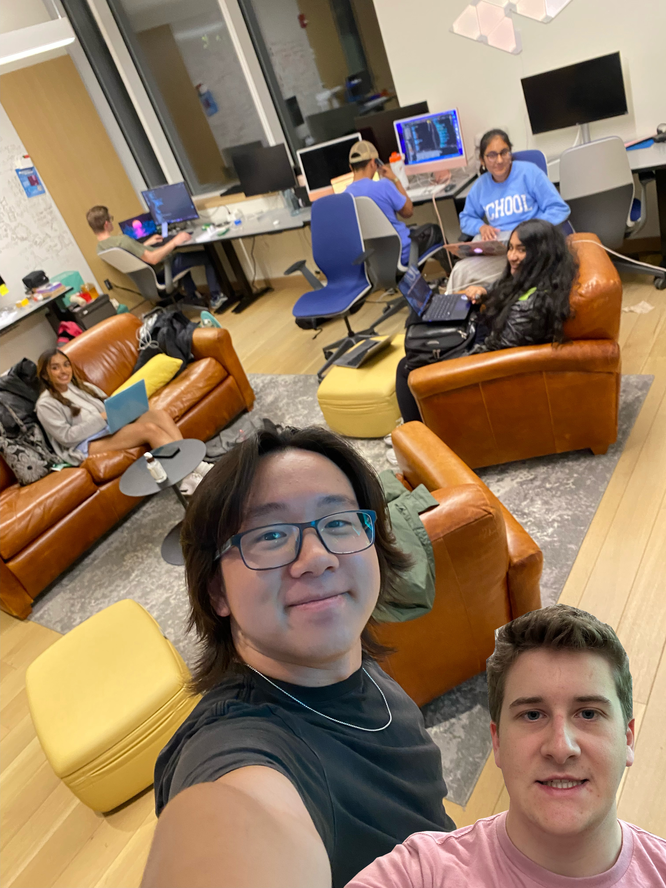

# Nerve



Our mobile app gamifies getting out of your comfort zone. It encourages people to take risks and do things that they wouldn't necessarily do otherwise. 

## Architecture
This uses React Native running on Expo.

Some packages we use are:


## Setup/Deployment

First, run ```git clone``` to clone the repository.

Then, run ```cd project-nerve/rn-app``` 

Then ```npm install``` to set up packages. Please make sure you are in the ```rn-app``` directory before doing this!!

Run ```npx expo start``` to start the app. If it doesn't load on your phone and recommends tunneling, run ```expo start --tunnel``` in the rn-app directory. Make sure your phone and computer are on the same wifi.

This will be deployed on Expo and possibly TestFlight.

Frontend URL: https://expo.dev/@cs52nerve/rn-app?serviceType=classic&distribution=expo-go
    - not currently on continuous integration, so do ```expo publish``` in the "rn-app" directory to re-publish newest changes
Backend URL: https://project-nerve-backend.onrender.com/

## Authors

Andy Kotz
Ashna Kumar
Devon Starr
Justin Chong
Nitya Agarwala
Sarah Chacko

## Acknowledgments

For our acknowledgements, We would like to thank our wonderful professor and TAs with providing us with the tools to build the app of our choosing.
